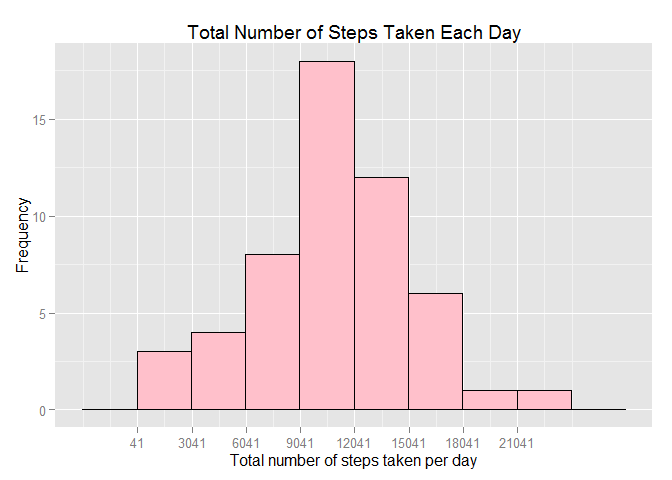
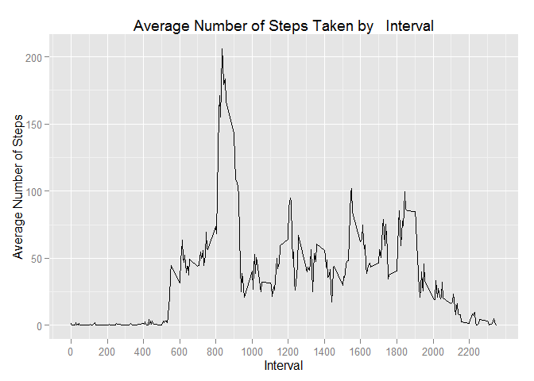
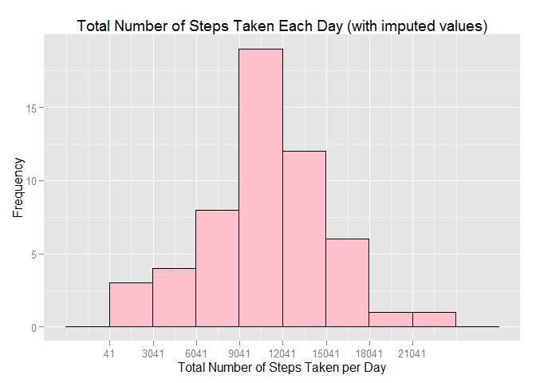
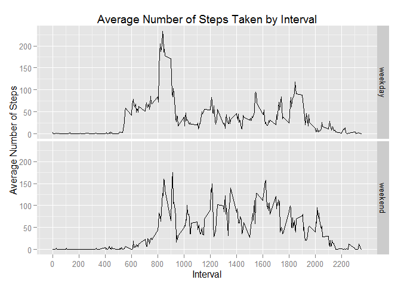

#Reproducible Research: Peer Assessment 1

##Loading and preprocessing the data

Show any code that is needed to

1. Load the data (i.e. read.csv())

2. Process/transform the data (if necessary) into a format suitable for your analysis


```r
library(ggplot2)
library(lubridate)
#need to use wday() instead of weekdays()
```


```r
# set the file url 
  fileurl <- c("http://d396qusza40orc.cloudfront.net/repdata%2Fdata%2Factivity.zip")

# create a temporary directory
  tdir <- tempdir()

# create the placeholder file
  tfile <- tempfile(tmpdir=tdir, fileext=".zip")

# download into the placeholder file tfile (works for WIN 8 64х)
  download.file(fileurl, tfile, method="auto", mode="wb")

# get the name of the first file in the zip archive
  fname <- unzip(tfile, list=TRUE)$Name[1]

# unzip the file to the temporary directory tdir
  unzip(tfile, files=fname, exdir=tdir, overwrite=TRUE)

# fpath is the full path to the extracted file
    fpath <- file.path(tdir, fname)

# load the csv in data frame
  MyData <- read.csv(fpath, as.is=TRUE)
```

##What is mean total number of steps taken per day?

For this part of the assignment, you can ignore the missing values in the dataset.

1. Make a histogram of the total number of steps taken each day.

2. Calculate and report the mean and median total number of steps taken per day.


```r
# generate MyData_Omit with complete cases only
  MyData_Omit <- na.omit(MyData)

# aggregate steps as per date to get total number of steps in a day
  Day_steps_sum <- aggregate(steps ~ date, MyData_Omit, sum)
  nbinwidth<-3000

  p <- ggplot(Day_steps_sum, aes(x = steps)) + geom_histogram(binwidth=nbinwidth, fill = "pink", 
       colour = "black") + scale_x_continuous("Total number of steps taken per day", breaks = seq (min (Day_steps_sum$steps),  max(Day_steps_sum$steps), nbinwidth)) + 
       scale_y_continuous("Frequency") + ggtitle("Total Number of Steps Taken Each Day")
  p
```

 

```r
# get mean and median total number of steps per day
  me_dss<-mean(Day_steps_sum$steps)
  me_dss
```

```
## [1] 10766.19
```

```r
  md_dss<-median(Day_steps_sum$steps)
  md_dss
```

```
## [1] 10765
```

*The mean and median total number of steps per day are 1.0766189\times 10^{4} and 10765 steps respectively.*

##What is the average daily activity pattern?

1. Make a time series plot (i.e. type = “l”) of the 5-minute interval (x-axis) and the average number of steps taken, averaged across all days (y-axis).

2. Which 5-minute interval, on average across all the days in the dataset, contains the maximum number of steps?


```r
# aggregate steps as interval to get average number of steps in an interval across all days
  Int_steps_mean <- aggregate(steps ~ interval, MyData_Omit, mean)

# generate the line plot of the 5-minute interval (x-axis) and the average number of 
# steps taken, averaged across all days (y-axis)


  p2 <- ggplot(data = Int_steps_mean, mapping = aes(x = interval, y = steps)) +
         geom_line() + scale_x_continuous("Interval",
        breaks = seq (min (Int_steps_mean$interval),  max(Int_steps_mean$interval), 200)) +   
         scale_y_continuous("Average Number of Steps") +
         ggtitle("Average Number of Steps Taken by   Interval")
  p2
```

 

```r
# find row with max of average number of steps in interval
  max_ave_steps_row_id <- which.max(Int_steps_mean$steps)

# get the interval with maximum average number of steps in an interval
  max_av_step<- Int_steps_mean [max_ave_steps_row_id, ]
  max_av_step
```

```
##     interval    steps
## 104      835 206.1698
```

*Thus 835-th 5-minute interval, on average across all the days in the dataset, contains 206.1698113  steps which is the maximum number of steps in av.*

##Imputing missing values

Note that there are a number of days/intervals where there are missing values (coded as NA). The presence of missing days may introduce bias into some calculations or summaries of the data.

1. Calculate and report the total number of missing values in the dataset (i.e. the total number of rows with NAs).

2. Devise a strategy for filling in all of the missing values in the dataset. The strategy does not need to be sophisticated. For example, you could use the mean/median for that day, or the mean for that 5-minute interval, etc.

3. Create a new dataset that is equal to the original dataset but with the missing data filled in.

4. Make a histogram of the total number of steps taken each day and Calculate and report the mean and median total number of steps taken per day. Do these values differ from the estimates from the first part of the assignment? What is the impact of imputing missing data on the estimates of the total daily number of steps?


```r
# number of rows with NA's
  nrow_NA <- nrow(MyData[!complete.cases(MyData),])
  nrow_NA
```

```
## [1] 2304
```

*Thus the total number of missing values in the dataset is equal 2304 from total number of rows 17568*

* For performing imputation, I replace the NA by the mean for that 5-minute interval. There are the nesessary  data just in the data frame “Int_steps_mean”. *


```r
# create a new dataset that is equal to the original dataset but with the missing data filled in.
  MyData_Imp<-MyData

  int   <-   MyData$interval[is.na(MyData$steps)]
  stint <-   Int_steps_mean$steps[which(Int_steps_mean$interval==int)]
  MyData_Imp$steps[is.na(MyData$steps)]   <-    stint

# aggregate steps as per date to get total number of steps in a day
  Day_steps_sum_imp <- aggregate(steps ~ date, MyData_Imp, sum)

# create histogram of total number of steps in a day
  nbinwidth<-3000

  p3 <- ggplot(Day_steps_sum_imp, aes(x = steps)) + geom_histogram(binwidth=nbinwidth, 
        fill =   "pink",   colour = "black") +
        scale_x_continuous("Total Number of Steps Taken per Day",
        breaks = seq (min (Day_steps_sum_imp$steps),  max(Day_steps_sum_imp$steps),
        nbinwidth)) +
        scale_y_continuous("Frequency") +
        ggtitle("Total Number of Steps Taken Each Day (with imputed values)")
  p3
```

 

```r
# get mean and median of total number of steps per day for filled in missed data 
  me_dss_imp<-mean(Day_steps_sum_imp$steps)
  md_dss_imp<-median(Day_steps_sum_imp$steps)

# get mean and median of total number of steps per day for data with NA's removed
#from the first part of the assignment
  me_dss
```

```
## [1] 10766.19
```

```r
  md_dss
```

```
## [1] 10765
```

*The mean and median total number of steps per day for fill in missed data  are 1.0766189\times 10^{4} and 1.0765594\times 10^{4} steps respectively. These values weakly differ from the estimates from the first part of the assignment  1.0766189\times 10^{4} and 10765. The means are same, there is slight change in median value. *

##Are there differences in activity patterns between weekdays and weekends?

For this part the weekdays() function may be of some help here. Use the dataset with the filled-in missing values for this part.

1. Create a new factor variable in the dataset with two levels – “weekday” and “weekend” indicating whether a given date is a weekday or weekend day.

2. Make a panel plot containing a time series plot (i.e. type = “l”) of the 5-minute interval (x-axis) and the average number of steps taken, averaged across all weekday days or weekend days (y-axis).


```r
# convert date from string to Date class
  MyData_Imp$date <- as.Date(MyData_Imp$date, "%Y-%m-%d")

# add a new column called day type 
  MyData_Imp$day_type <- ifelse(wday(MyData_Imp$date) %in% c(7, 1),   "weekend", "weekday")
  

# convert day_time from character to factor
  MyData_Imp$day_type <- as.factor(MyData_Imp$day_type)

# aggregate steps as interval to get average number of steps in an interval across all days
  Int_steps_mean_Imp <- aggregate(steps ~ interval+day_type, MyData_Imp, mean)

# make the panel plot for weekdays and weekends
  p4 <- ggplot(data = Int_steps_mean_Imp, mapping = aes(x = interval, y = steps)) + 
        geom_line() + facet_grid(day_type ~ .) + 
        scale_x_continuous("Interval", breaks = seq(min(Int_steps_mean_Imp$interval),
        max(Int_steps_mean_Imp$interval), 200)) +
        scale_y_continuous("Average Number of Steps") +
        ggtitle("Average Number of Steps Taken by Interval")
  p4
```

 

*There are a lot of differences between weekdays and weekends because of different schedule *
